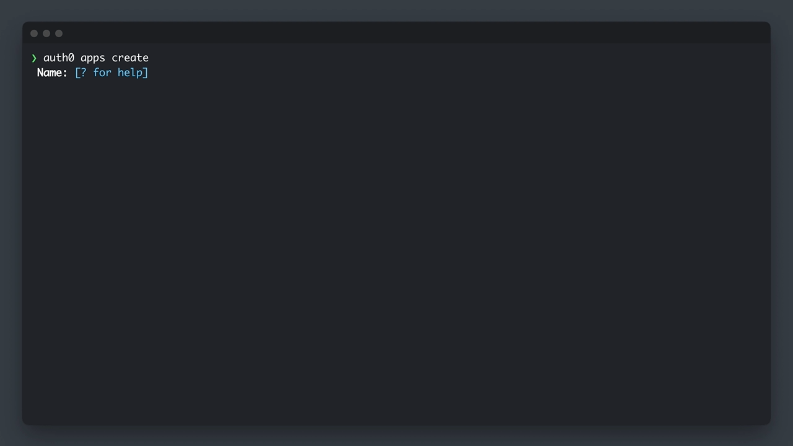

<div align="center">
  <h1>Auth0 CLI</h1>

[](https://pkg.go.dev/github.com/auth0/auth0-cli)
[](https://goreportcard.com/report/github.com/auth0/auth0-cli)
[](https://github.com/auth0/auth0-cli/releases)
[](https://codecov.io/gh/auth0/auth0-cli)
[](https://github.com/auth0/auth0-cli/blob/main/LICENSE)
[](https://github.com/auth0/auth0-cli/actions?query=branch%3Amain)
[](https://deepwiki.com/auth0/auth0-cli)

</div>

---

Build, manage and test your [Auth0](https://auth0.com/) integrations from the command line.



## Highlights

- **🧪 Test your universal login flow:** Emulate your end users' login experience by running `auth0 test login`.
- **🔍 Troubleshoot in real-time:** Inspect the events of your Auth0 integration as they happen with the `auth0 logs tail` command.
- **🔁 Simplify repetitive tasks:** Create, update, list and delete your Auth0 resources directly from the terminal.

## Table of Contents

- [Installation](#installation)
- [Authenticating to Your Tenant](#authenticating-to-your-tenant)
- [Available Commands](#available-commands)
- [Customization](#customization)
- [Anonymous Analytics](#anonymized-analytics-disclosure)

## Installation

### Linux and macOS

Install via [Homebrew](https://brew.sh/):

```bash
brew tap auth0/auth0-cli && brew install auth0
```

Install via [cURL](https://curl.se/):

1. Download the binary. It will be placed in `./auth0`:
  ```bash
  curl -sSfL https://raw.githubusercontent.com/auth0/auth0-cli/main/install.sh | sh -s -- -b .
  ```
2. Optionally, if you want to be able to run the binary from any directory, make sure you move it to a place in your $PATH:
  ```bash
  sudo mv ./auth0 /usr/local/bin
  ```
  > [!TIP]
  > On macOS, depending on the state of your current development environment you may have to first create the directory with `sudo mkdir -p /usr/local/bin` in order for the above command to work. Alternatively, you can move it to a directory of your choice and then add that directory to your $PATH instead.

### Windows

Install via [Scoop](https://scoop.sh/):

```bash
scoop bucket add auth0 https://github.com/auth0/scoop-auth0-cli.git
scoop install auth0
```


Install via [Powershell](https://learn.microsoft.com/en-us/powershell/):

1. Fetch latest release information with the following commands:
  ```powershell
  $latestRelease = Invoke-RestMethod -Uri "https://api.github.com/repos/auth0/auth0-cli/releases/latest"
  $latestVersion = $latestRelease.tag_name
  $version = $latestVersion -replace "^v"
  ```
2. Download the binary to the current folder:
  ```powershell
  Invoke-WebRequest -Uri "https://github.com/auth0/auth0-cli/releases/download/${latestVersion}/auth0-cli_${version}_Windows_x86_64.zip" -OutFile ".\auth0.zip"
  Expand-Archive ".\auth0.zip" .\
  ```
3. To be able to run the binary from any directory, make sure you add it to your $PATH. This can be done through Powershell by entering the following command:
  ```powershell
  [System.Environment]::SetEnvironmentVariable('PATH', $Env:PATH + ";${pwd}")
  ```
  Alternatively, follow the instructions in the Manual section below. Learn more about [environment variables in Powershell](https://learn.microsoft.com/en-us/powershell/module/microsoft.powershell.core/about/about_environment_variables?view=powershell-7.4)

### Go

Install via [Go](https://go.dev/):

```bash
# Make sure your $GOPATH/bin is exported on your $PATH
# to be able to run the binary from any directory.
go install github.com/auth0/auth0-cli/cmd/auth0@latest
```

### Manual

1. Download the appropriate binary for your environment from the [latest release](https://github.com/auth0/auth0-cli/releases/latest/)
2. Extract the archive
   - **macOS**: `$ tar -xf auth0-cli_{version}_Darwin_{architecture}.tar.gz`
   - **Linux**: `$ tar -xf auth0-cli_{version}_Linux_{architecture}.tar.gz`
   - **Windows**: Extract `auth0-cli_{version}_Windows_{architecture}.zip` using your preferred method for working with compressed files.
3. Make sure that the `PATH` and `HOME` environment variables include the folder where the binary was extracted.
   - **macOS/Linux**:
     1. Open your shell configuration file (for example, ~/.bashrc for bash, ~/.zshrc for zsh) and ensure the following variables `PATH` and `HOME` are set correctly:
    
       ```bash
       export PATH=$PATH:/path/to/extracted/auth0/cli/folder
       export HOME=/path/to/home/directory
       ```

     2. After editing the file, run source ~/.bashrc or source ~/.zshrc (depending on your shell) to apply the changes.

   - **Windows**:
     1. Open the Start Menu, search for "Environment Variables", and select "Edit the system environment variables".
     2. In the System Properties window, click on the "Environment Variables" button.
     3. Under "User variables", select Path and click "Edit". Add the path to the directory where you extracted the auth0.exe file.
     4. Click 'OK' to close the Edit environment variable dialog and return to the Environment Variables dialog.
     5. Click "New" to add a new HOME variable, and set it to your home directory path.
     6. Click "OK" to apply the changes.
     7. Close any existing Powershell or Command Prompt windows, and re-open your terminal in order to load the new environment variables you've just finished creating.

4. Run `auth0`

> [!TIP]
> Autocompletion instructions for supported platforms available by running `auth0 completion -h`

## Authenticating to Your Tenant

Authenticating to your Auth0 tenant is required for most functions of the CLI. It can be initiated by running:

```bash
auth0 login
```

There are two ways to authenticate:

- **As a user** - Recommended when invoking on a personal machine or other interactive environment. Facilitated by [device authorization](https://auth0.com/docs/get-started/authentication-and-authorization-flow/device-authorization-flow) flow and cannot be used for private cloud tenants.
- **As a machine** - Recommended when running on a server or non-interactive environments (ex: CI, authenticating to a **private cloud**).  Facilitated by [client credentials](https://auth0.com/docs/get-started/authentication-and-authorization-flow/client-credentials-flow) flow. Flags available for bypassing interactive shell.


> **Warning**
> Authenticating as a user is not supported for **private cloud** tenants. 
> Instead, those users should authenticate with client credentials.
> Refer command below:

```bash
auth0 login --domain <domain> --client-id <client-id> --client-secret <client-secret>
auth0 login --domain <domain> --client-id <client-id> --client-assertion-private-key <path-to-private-key / private-key> --client-assertion-signing-alg <signing-algorithm>
```

> **Note:**
> Using the CLI will consume Management API rate limits according to the subscription plan. Ref [Rate limit Policy](https://auth0.com/docs/troubleshoot/customer-support/operational-policies/rate-limit-policy)

## Available Commands

- [auth0 actions](https://auth0.github.io/auth0-cli/auth0_actions.html) - Manage resources for actions
- [auth0 api](https://auth0.github.io/auth0-cli/auth0_api.html) - Makes an authenticated HTTP request to the Auth0 Management API
- [auth0 apis](https://auth0.github.io/auth0-cli/auth0_apis.html) - Manage resources for APIs
- [auth0 apps](https://auth0.github.io/auth0-cli/auth0_apps.html) - Manage resources for applications
- [auth0 completion](https://auth0.github.io/auth0-cli/auth0_completion.html) - Setup autocomplete features for this CLI on your terminal
- [auth0 domains](https://auth0.github.io/auth0-cli/auth0_domains.html) - Manage custom domains
- [auth0 email](https://auth0.github.io/auth0-cli/auth0_email.html) - Manage email settings
- [auth0 login](https://auth0.github.io/auth0-cli/auth0_login.html) - Authenticate the Auth0 CLI
- [auth0 logout](https://auth0.github.io/auth0-cli/auth0_logout.html) - Log out of a tenant's session
- [auth0 logs](https://auth0.github.io/auth0-cli/auth0_logs.html) - View tenant logs
- [auth0 orgs](https://auth0.github.io/auth0-cli/auth0_orgs.html) - Manage resources for organizations
- [auth0 protection](https://auth0.github.io/auth0-cli/auth0_protection.html) - Manage resources for attack protection
- [auth0 quickstarts](https://auth0.github.io/auth0-cli/auth0_quickstarts.html) - Quickstart support for getting bootstrapped
- [auth0 roles](https://auth0.github.io/auth0-cli/auth0_roles.html) - Manage resources for roles
- [auth0 rules](https://auth0.github.io/auth0-cli/auth0_rules.html) - Manage resources for rules
- [auth0 tenants](https://auth0.github.io/auth0-cli/auth0_tenants.html) - Manage configured tenants
- [auth0 test](https://auth0.github.io/auth0-cli/auth0_test.html) - Try your Universal Login box or get a token
- [auth0 terraform generate](https://auth0.github.io/auth0-cli/auth0_terraform_generate.html) - Generate terraform configuration for your Auth0 Tenant
- [auth0 universal-login](https://auth0.github.io/auth0-cli/auth0_universal-login.html) - Manage the Universal Login experience
- [auth0 users](https://auth0.github.io/auth0-cli/auth0_users.html) - Manage resources for users

## Customization

To change the text editor used for editing templates, rules, and actions, set the environment variable `EDITOR` to your
preferred editor. If choosing a non-terminal editor, ensure that the command starts the editor and waits for the files
to be closed before returning.

Examples:

```shell
# Uses vscode with the --wait flag.
export EDITOR="code --wait"

# Uses sublime text with the --wait flag.
export EDITOR="subl --wait"

# Uses nano, a terminal based editor.
export EDITOR="nano"

# Uses vim, a terminal based editor.
export EDITOR="vim"
```

## Anonymized Analytics Disclosure

Anonymized data points are collected during the use of this CLI. This data includes the CLI version, operating system, timestamp, and other technical details that do not personally identify you.

Auth0 uses this data to better understand the usage of this tool to prioritize the features, enhancements and fixes that matter most to our users.

To **opt-out** of this collection, set the `AUTH0_CLI_ANALYTICS` environment variable to `false`.

## Feedback

### Contributing

We appreciate feedback and contribution to this repo! Before you get started, please see the following:

- [Auth0's general contribution guidelines](https://github.com/auth0/open-source-template/blob/master/GENERAL-CONTRIBUTING.md)
- [Auth0's code of conduct guidelines](https://github.com/auth0/open-source-template/blob/master/CODE-OF-CONDUCT.md)
- [This repo's contribution guide](https://github.com/auth0/auth0-cli/blob/main/CONTRIBUTING.md)

### Raise an issue

To provide feedback or report a bug, please [raise an issue on our issue tracker](https://github.com/auth0/auth0-cli/issues).

### Vulnerability Reporting

Please do not report security vulnerabilities on the public GitHub issue tracker. The [Responsible Disclosure Program](https://auth0.com/responsible-disclosure-policy) details the procedure for disclosing security issues.

---

<p align="center">
  <picture>
    <source media="(prefers-color-scheme: light)" srcset="https://cdn.auth0.com/website/sdks/logos/auth0_light_mode.png"   width="150">
    <source media="(prefers-color-scheme: dark)" srcset="https://cdn.auth0.com/website/sdks/logos//auth0_dark_mode.png" width="150">
    
  </picture>
</p>
<p align="center">Auth0 is an easy to implement, adaptable authentication and authorization platform. To learn more checkout <a href="https://auth0.com/why-auth0">Why Auth0?</a></p>
<p align="center">
This project is licensed under the MIT license. See the <a href="https://github.com/auth0/auth0-cli/blob/main/LICENSE"> LICENSE</a> file for more info.</p>
