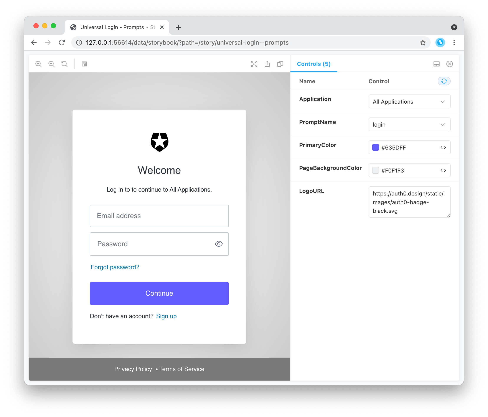
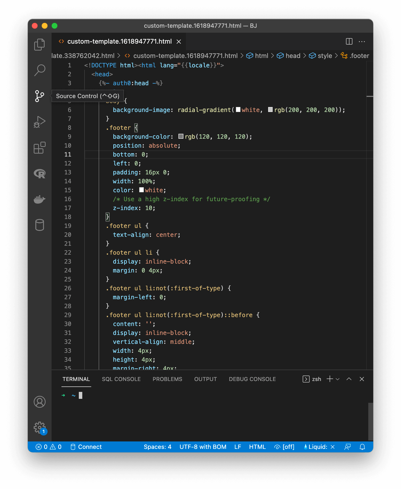

## auth0 branding templates

Manage custom page templates

### Synopsis

Manage custom [page templates](https://auth0.com/docs/universal-login/new-experience/universal-login-page-templates). This requires a custom domain to be configured for the tenant.

This command will open two windows:

* A browser window with a [Storybook](https://storybook.js.org/) that shows the login page with the page template applied:



* The default terminal editor, with the page template code:



You now change the page template code, and the changes will be reflected in the browser window. 

Once you close the window, you’ll be asked if you want to save the template. If you answer Yes, the template will be uploaded to your tenant.

### Options

```
  -h, --help   help for templates
```

### Options inherited from parent commands

```
      --debug           Enable debug mode.
      --force           Skip confirmation.
      --format string   Command output format. Options: json.
      --no-color        Disable colors.
      --no-input        Disable interactivity.
      --tenant string   Specific tenant to use.
```

### SEE ALSO

* [auth0 branding](auth0_branding.md)	 - Manage branding options
* [auth0 branding templates show](auth0_branding_templates_show.md)	 - Display the custom template for Universal Login
* [auth0 branding templates update](auth0_branding_templates_update.md)	 - Update the custom template for Universal Login
