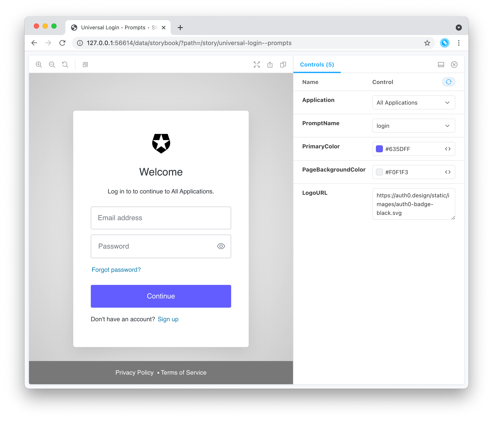
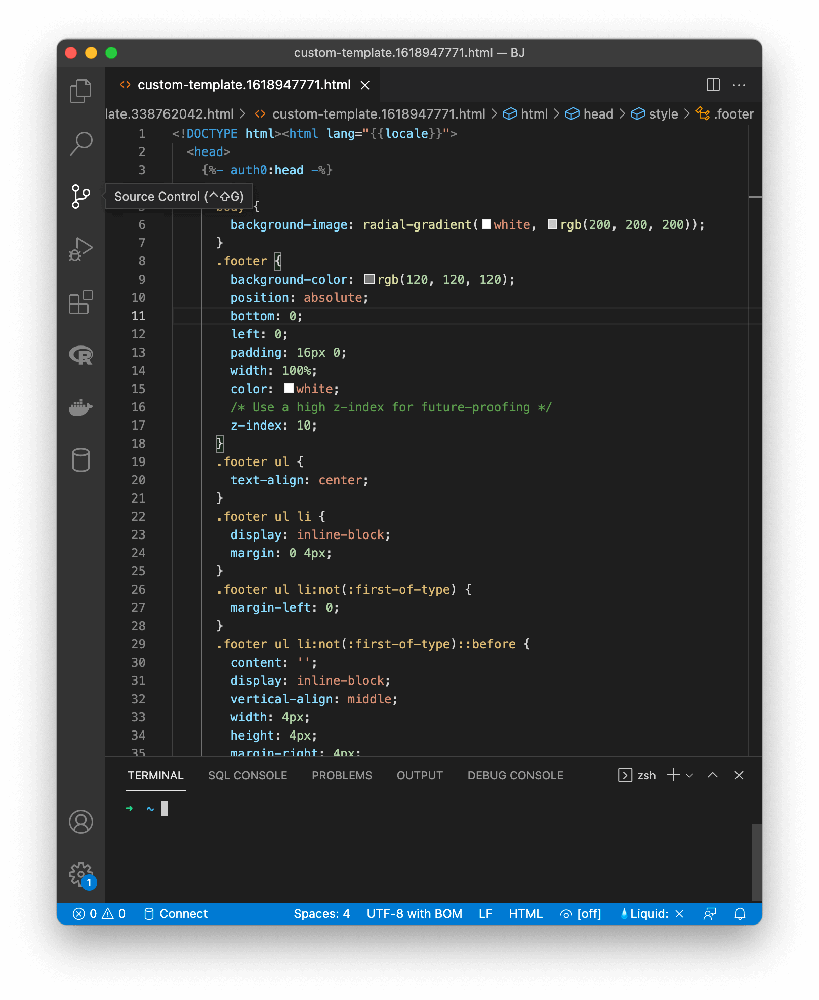

# auth0 universal-login templates

Manage custom [page templates](https://auth0.com/docs/universal-login/new-experience/universal-login-page-templates). This requires a custom domain to be configured for the tenant.

This command will open two windows:

* A browser window with a [Storybook](https://storybook.js.org/) that shows the login page with the page template applied:

* The default terminal editor, with the page template code:

You now change the page template code, and the changes will be reflected in the browser window. 

Once you close the window, you’ll be asked if you want to save the template. If you answer Yes, the template will be uploaded to your tenant.

## Commands

- [auth0 universal-login templates show](auth0_universal-login_templates_show.md) - Display the custom template for Universal Login
- [auth0 universal-login templates update](auth0_universal-login_templates_update.md) - Update the custom template for Universal Login

